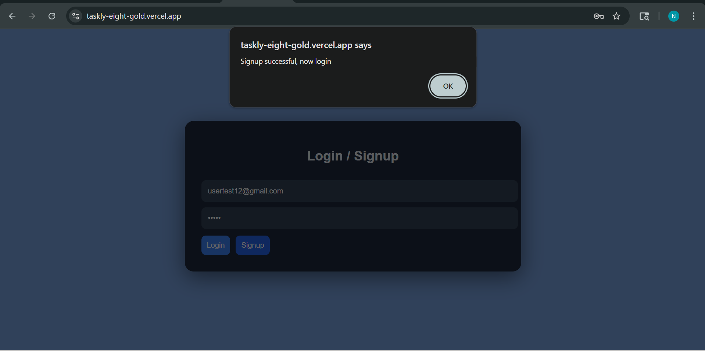
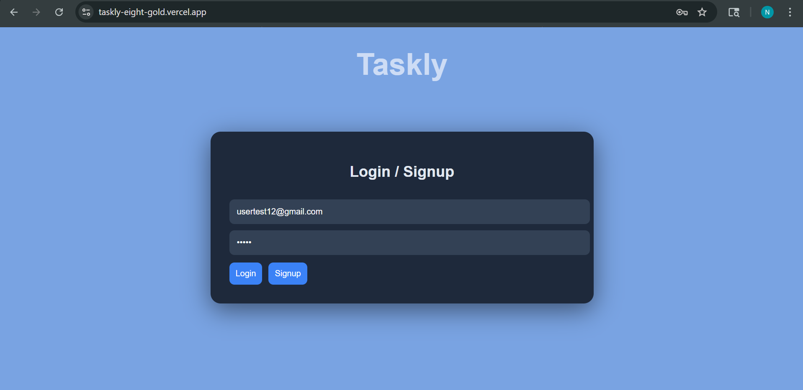
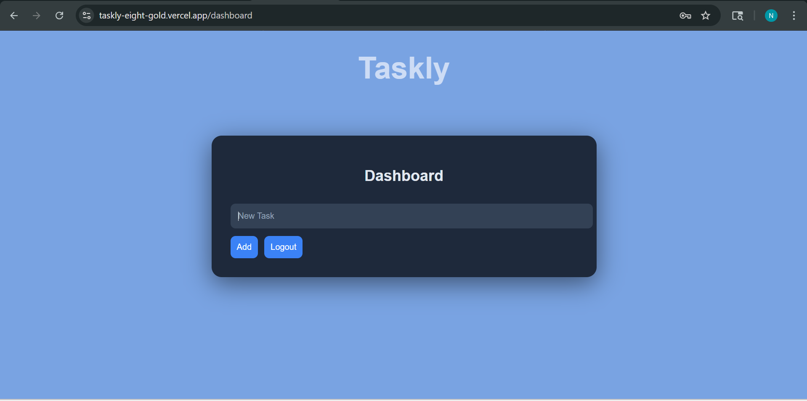
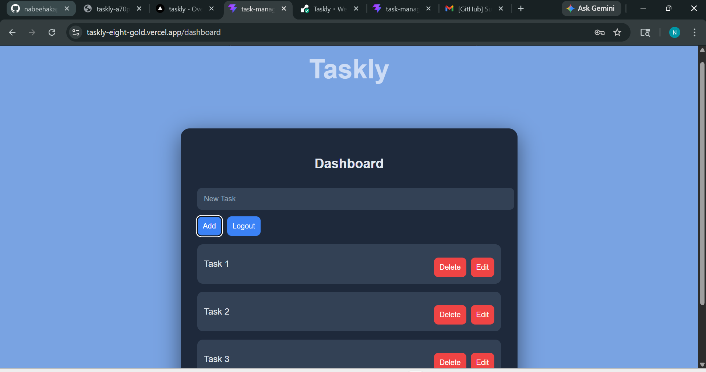

# Taskly — Full Stack Task Manager

A clean,  full-stack beginner task manager built with React, Node.js, and MongoDB.

## Features

- User Authentication (Signup/Login)
- Create, Edit, Delete the Completed or Unwanted Tasks
- Protected routes using JWT
- Fully deployed (frontend + backend)

## Tech Stack

**Frontend**
- React (Vite)
- Axios
- React Router

**Backend**
- Node.js
- Express

**Database**
- MongoDB Atlas

**Deployment**
- Vercel (Frontend)
- Render (Backend)

---

##  Live Demo

Frontend: https://taskly-eight-gold.vercel.app/
Backend: https://taskly-a70p.onrender.com/

---

##  Screenshots





---

##  How to Run Locally

```bash
# Clone repo
git clone https://github.com/nabeehakappan/Task-Manager.git

# Backend
cd task-manager-backend
npm install
npm run dev

# Frontend
cd task-manager-frontend
npm install
npm run dev